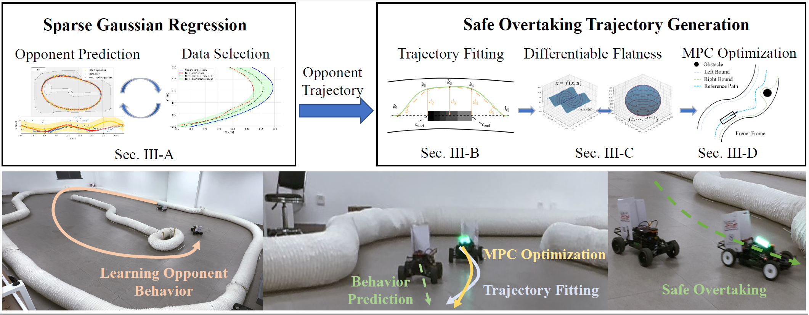
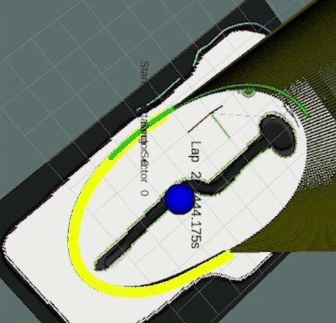
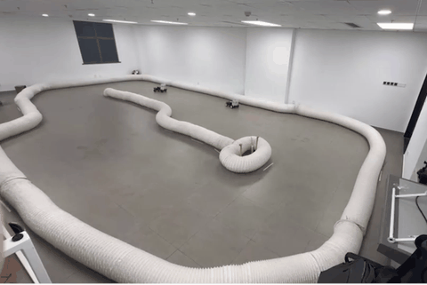

# FSDP: Fast and Safe Data-Driven Overtaking Trajectory Planning

<p align="center">
  <a href="https://arxiv.org/abs/2503.06075">
    
  </a>
  
  
  
  
</p>

`fsdp` is the ROS package implementation of
[FSDP: Fast and Safe Data-Driven Overtaking Trajectory Planning for Head-to-Head Autonomous Racing Competitions](https://arxiv.org/abs/2503.06075).
It uses sparse Gaussian Process opponent prediction, collision-risk checking, and a bi-level QP planning pipeline: polynomial fitting produces a rough overtaking trajectory, then a Frenet-frame MPC QP refines it with kinematic and safety constraints.



## Demo

<table>
  <tr>
    <td align="center"><strong>Simulation / Planning View</strong></td>
    <td align="center"><strong>Physical F1TENTH Platform</strong></td>
  </tr>
  <tr>
    <td></td>
    <td></td>
  </tr>
</table>

## Package Layout

- `launch/fsdp.launch`: package-level launch file for the FSDP planning pipeline.
- `src/sqp/`: main FSDP overtaking planner nodes; `sqp` is the legacy folder and node naming.
- `src/soc/`: collision prediction and dynamic collision tuning.
- `src/gp/`: opponent trajectory projection and GP prediction nodes.
- `src/waypoint/`: `/global_waypoints_updated` publisher.
- `src/common/`: shared Frenet, polynomial fitting, and QP helpers.
- `src/mpc/`: vehicle model, MPC controllers, and pybind11 C++ extension.
- `cfg/*.cfg`: dynamic reconfigure parameters for collision prediction and SQP tuning.

## Build

```bash
cd ~/catkin_ws
catkin build fsdp
```

The package now builds the local `mpc_builder` extension automatically during `catkin build` and installs the runtime Python packages into the catkin devel Python path. A quick verification is:

```bash
python3 - <<'PY'
import mpc_builder
from common.qp_fit import QPFit
from mpc.mpc_tracking_controller_ca import MPC_Tracking_Controller
print("fsdp imports OK:", mpc_builder.__file__)
PY
```

When installing this package with the original race stack, keep the race stack submodules enabled. The GP node depends on the local `ccma` package:

```bash
git submodule update --init --recursive
pip install /path/to/race-stack/f110_utils/libs/ccma
```

## Quick Start

Start the base simulator:

```bash
cd ~/catkin_ws
roslaunch stack_master base_system.launch sim:=True racecar_version:=SIM map_name:=f rviz:=false
```

In a second terminal, launch the FSDP planner nodes:

```bash
roslaunch fsdp fsdp.launch
```

In a third terminal, publish a simulated opponent obstacle:

```bash
roslaunch obstacle_publisher obstacle_publisher.launch speed_scaler:=0.3
```

Open `rqt_reconfigure` and enable the overtaking sectors if the state machine is still staying on the raceline:

```bash
rqt_reconfigure
```

## Direct Launch

You can also launch only the package nodes:

```bash
roslaunch fsdp fsdp.launch
```

Useful launch args:

```bash
roslaunch fsdp fsdp.launch launch_state_machine:=false
roslaunch fsdp fsdp.launch launch_gp:=false
roslaunch fsdp fsdp.launch launch_waypoint_updater:=false
```

This is handy for smoke tests or when another launch file already starts the state machine.

## What To Watch

These topics are the fastest way to confirm the pipeline is alive:

```bash
rostopic hz /perception/obstacles
rostopic hz /proj_opponent_trajectory
rostopic hz /opponent_trajectory
rostopic hz /collision_prediction/obstacles
rostopic hz /global_waypoints_updated
rostopic hz /planner/avoidance/otwpnts
```

RViz markers:

- `/opponent_traj_markerarray`
- `/planner/avoidance/markers_sqp`
- `/planner/avoidance/df_markers`
- `/planner/avoidance/mpc_markers`
- `/planner/avoidance/raw_traj_markers`

## Runtime Notes

- `launch_gp:=true` starts the full opponent prediction chain and requires `ccma`, `torch`, `gpytorch`, `scikit-learn`, and `pandas`.
- The planner waits for `/global_waypoints`, `/global_waypoints_updated`, and obstacle topics, so a direct package launch without the base stack may appear idle.
- Generated build products under `build/`, `src/mpc_builder*.so`, debug data, and spreadsheet outputs are ignored by `.gitignore`.
- In a stack-level launch file, include `launch/fsdp.launch` or map the stack planner option to `planner:=fsdp`.

## Citation

```bibtex
@inproceedings{hu2025fsdp,
  title={Fsdp: Fast and safe data-driven overtaking trajectory planning for head-to-head autonomous racing competitions},
  author={Hu, Cheng and Huang, Jihao and Mao, Wule and Fu, Yonghao and Chi, Xuemin and Qin, Haotong and Baumann, Nicolas and Liu, Zhitao and Magno, Michele and Xie, Lei},
  booktitle={2025 IEEE/RSJ International Conference on Intelligent Robots and Systems (IROS)},
  pages={5824--5831},
  year={2025},
  organization={IEEE}
}
```
